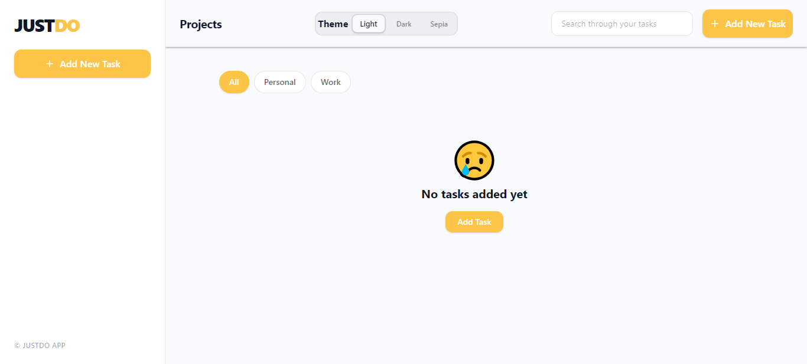
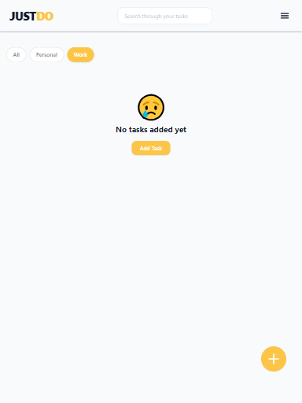
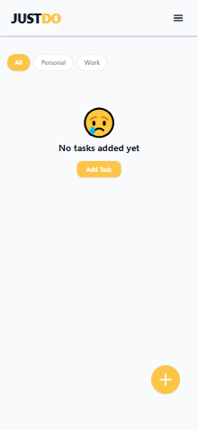

# JUSTDO - CRUD Todo App

TaskFlow is an easy-to-use, responsive task-management web app designed to give users a seamless and forgiving experience.

## Table of contents

- [JUSTDO - CRUD Todo App](#justdo---crud-todo-app)
  - [Table of contents](#table-of-contents)
  - [The Project](#the-project)
    - [Screenshot](#screenshot)
    - [Link](#link)
  - [Key Features](#key-features)
  - [Tech Stack](#tech-stack)
  - [Quickstart](#quickstart)
  - [Directory Structure](#directory-structure)
  - [Key Learned Insights](#key-learned-insights)
  - [Future Roadmap](#future-roadmap)
    - [Phase 1: Data Portability \& Productivity Enhancements](#phase-1-data-portability--productivity-enhancements)
    - [Phase 2: Cloud Sync \& Backend Integration](#phase-2-cloud-sync--backend-integration)
    - [Phase 3: Collaboration \& Customization](#phase-3-collaboration--customization)

## The Project

JUSTDO is a client-side task-management web application designed to deliver an intuitive, responsive, and forgiving user experience. Built with React and Tailwind CSS, the application operates entirely within the browser, utilizing localStorage for state persistence.

This project was built and documented publicly through a weekly #BuildingInPublic series on LinkedIn, detailing the progressive evolution from a core CRUD prototype to a fully responsive, multi-themed productivity suite.

### Screenshot


 


### Link

Check out the full  [Live Site](https://crud-project-woad-eight.vercel.app/)

## Key Features

- Dynamic Task Management (CRUD)
  - Create, Read, Update, Delete: Full task lifecycle management with persistent storage.

  - Context & Schedules: Task items support rich descriptions along with explicit Start Dates and Due Dates for project timeline tracking.

- Category & Organization System
  - Dynamic creation and customization of task categories.

  - System-wide task categorization with real-time category filtering.

- Stateful Deletion & Undo Mechanism
  - Temporal State Buffer: Deleting a task triggers a temporary holding state prior to permanently purging data from localStorage.

  - Instant Restoration: Users receive an immediate UI prompt allowing them to undo accidental deletions, preserving data integrity.

- Search & Filtering Engine
  - Real-time search algorithm parsing through active task titles, rich descriptions, subtasks, and category tags.

  - Custom sorting logic to prioritize tasks based on completion status, timelines, and category parameters.

- Personalization & Design System
  - 3-Theme System: Dynamic theme switcher allowing toggling between distinct visual presets (e.g., Light, Dark, Accent modes).

  - Persistent theme preference saved to local browser storage.

- Mobile-First Responsive Layout
  - Refactored layout grid leveraging Tailwind CSS breakpoints (sm:, md:, lg:).

  - Adaptive navigation menus and search controls designed for smaller touch viewports without horizontal layout overflow.

  - Mobile-optimized touch targets for date pickers, category tags, and action buttons.

## Tech Stack

- Frontend: React.js
- Styling: TailwindCSS V4
- State Management: Web Storage API (localStorage)
- Deployment Platform: Vercel / Live Web Hosting

## Quickstart

```text
git clone https://github.com/Banini-AD/crud-project.git

cd crud-project

npm install

npm run dev
```

## Directory Structure

```text
├── src/
│   ├── components/    # Reusable UI components
│   ├── hooks/         # Custom state & utility hooks
│   ├── App.jsx        # Root application layout
│   └── main.jsx       # Application entry point
├── public/            # Static assets
└── README.md
```

## Key Learned Insights

- Deeply Nested State Synchronization: Synchronizing state across multi-level task arrays (containing subtasks and dates) while simultaneously filtering by category, querying via search, and maintaining continuous synchronization with localStorage required strict immutability patterns in React.

- Temporal Undo Buffer: Decoupling immediate UI removal from persistent storage updates allowed the creation of a seamless "Undo" feature without compromising local storage efficiency or causing state desynchronization.

- Responsive Layout Constraints: Implementing dynamic theme switching alongside complex multi-column boards required leveraging a mobile-first design strategy to prevent re-render flickers and layout shifts across different screen sizes.

## Future Roadmap

### Phase 1: Data Portability & Productivity Enhancements

- Data Export & Import: Enable JSON/CSV data export and import so users can back up their task data or migrate between browsers without relying solely on localStorage.

- Drag-and-Drop Reordering: Integrate smooth drag-and-drop mechanics (using libraries like hello-pangea/dnd or @dnd-kit) for custom task prioritization and subtask reordering.

- Task Analytics & Statistics: Add a visual dashboard displaying completion rates, overdue tasks, and category breakdown charts.

### Phase 2: Cloud Sync & Backend Integration

- User Authentication: Transition from client-only storage to authenticated accounts using Supabase or Firebase.

- Database Integration: Connect to a PostgreSQL database for real-time cloud data synchronization across multiple devices.

- Push Notifications: Implement web push notifications for task due-date reminders and upcoming deadlines.

### Phase 3: Collaboration & Customization

- Shared Workspaces: Allow users to share task categories or lists with team members via unique access links.

- Custom Theme Creator: Expand the 3-theme system into a customizable color picker system with saved user presets.
